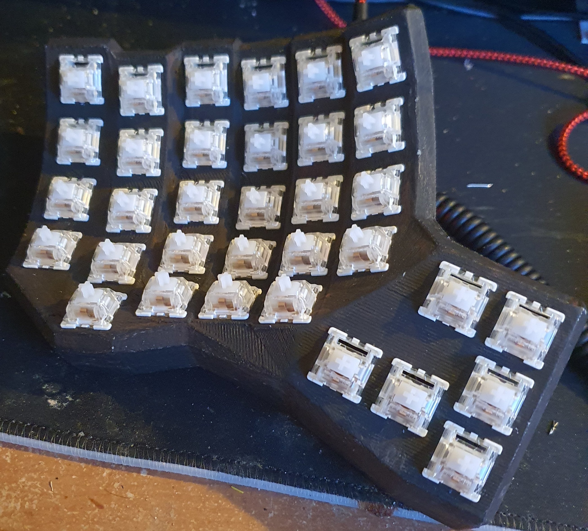

# Dactyl CC Keyboard
[WORK IN PROGRESS]

The 3d files can be found @ [Dactyl CC Github](https://github.com/mjohns/dactyl-cc)

I started by printing all the parts needed for Dactyl CC, then I noticed there was no box / holder for the micro or the trrs connector.

So I created a first draft of Teensy plus trrs connector holder for dactyl and another holder for only the trrs only. 

For the Teensy holder you will need to cut the middle bit of the 2 holes, and it should fit well enough there. 

For the trrs holder, it should fit into either hole well enough.

3D_files ->
* teensy_holder2.FCStd
* trrs_holder.FCStd

## Parts Needed
* [PLA Filament](https://www.amazon.co.uk/gp/product/B08GCJR1QC/ref=ppx_yo_dt_b_asin_title_o08_s00?ie=UTF8&psc=1)
* [1N4148 Diodes](https://www.amazon.co.uk/gp/product/B07QDNC9YY/ref=ppx_yo_dt_b_asin_title_o09_s00?ie=UTF8&psc=1)
* [TRRS cable](https://www.amazon.co.uk/gp/product/B07FFT6L12/ref=ppx_yo_dt_b_asin_title_o07_s00?ie=UTF8&th=1)
* [TRRS connector](https://www.amazon.co.uk/gp/product/B07KYCC7RN/ref=ppx_yo_dt_b_asin_title_o07_s00?ie=UTF8&psc=1)
* [Teensy 4.0](https://www.amazon.co.uk/gp/product/B07W5J3WNH/ref=ppx_yo_dt_b_asin_title_o03_s00?ie=UTF8&psc=1)
* [MCP23017 IO Expander](https://www.amazon.co.uk/gp/product/B07MLSCLWY/ref=ppx_yo_dt_b_asin_title_o05_s00?ie=UTF8&psc=1)
* [M3 Thread nut inserts](https://www.amazon.co.uk/gp/product/B08YWXMC3D/ref=ppx_yo_dt_b_asin_title_o00_s00?ie=UTF8&psc=1)
* [M3 flat head screws](https://www.amazon.co.uk/gp/product/B0819QXRBR/ref=ppx_yo_dt_b_asin_title_o00_s00?ie=UTF8&psc=1)
* [Keycaps](https://kbdfans.com/collections/dsa-profile/products/dsa-ergo-blank-keycaps)
* [30 Awg wire](https://www.amazon.co.uk/uxcell-Wrapping-Plated-DM-30-1000-Eletronic/dp/B07HFB2MX4/ref=sr_1_6?dchild=1&keywords=30%2Bawg%2Bwire&qid=1629043302&sr=8-6&th=1)

I bought these KBDFans keycaps and I had to alter the 1.5 keycaps a little to make them fit. I will most likely order the Kinesis original keycaps next time, just to keep the colour configuration on the mid row and also so I will not have to modify any of the keys.

## Building QMK Firmware
Included is the bash script for downloading QMK and building it correctly with the teensy 4.0.

\> git clone https://github.com/netscream/dactyl_cc

\> cd dactyl_cc

\> chmod +x build_dactyl_cc_teensy40.sh

\> ./build_dactyl_cc_teensy40.sh

This build might take some time as this will download qmk and all submodules that are needed, then it will build the firmware.

When the build has finished your should have a file called "dactyl_cc_teensy40_netscream.hex" in the root directory.

\>ls 

\>README.md  build_dactyl_cc_teensy40.sh  dactyl_cc_teensy40_netscream.hex ................ etc.

## The Keyboard in pictures
### Drawings
#### Left Setup

#### Right Setup

#### IO Expander

#### 3D Print

#### Painted with switches

#### Left Wiring

## Fully Ready
### Left

### Right
